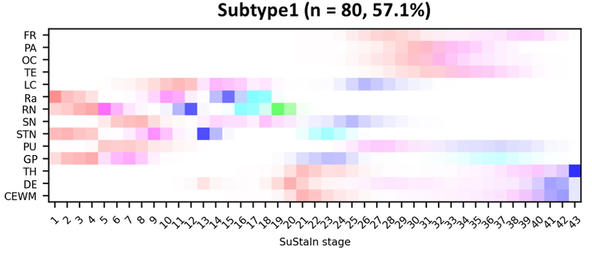

## Profile

I am a Postdoctoral Researcher at the University of Bern, working on Deep Learning models applied to healthcare. I focus on applying these methods to neuroimaging and actigraphy (movement data) for disease diagnosis, prediction, and progression modelling.

Due to my interdisciplinary background in medicine and biomedical engineering, I bring extensive scientific and clinical knowledge, as well as strong analytical and technical skills. I also have teaching experience and have led projects and collaborations with industry partners.

I was always fascinated by the human brain and how it can inspire better AI, from understanding neural processes to building models that mimic them. My goal is to contribute to AI systems that not only improve medical decision-making but are also transparent, trustworthy, and grounded in both science and real-world impact.

## Education

-------

**PhD in AI in Medical Imaging**  
*University of Bern, Switzerland*  
**Oct 2021 – June 2025**  
- Research focus: AI-based diagnosis and progression modelling of neurodegenerative disorders
- Awarded with highest grade; Nominated for Best PhD Thesis Award
  
-------

**Master’s Degree in Medicine (M.D.)**  
*University of Coimbra, Portugal*  
**Sep 2014 – Jul 2021**  
- Completed full clinical training, including final-year rotations across multiple specialties
  
-------

**Minor in Biomedical Engineering**  
*University of Coimbra, Portugal*  
**Feb 2018 – Jul 2021**  
- Completed over 100 ECTS in Mathematics, Algebra, Physics, Programming, Biomechanics, Computational Physiology
  
-------

## Research & Projects

#### AI for Disease Progression in Parkinson's Disease
- Developed and validated AI and statistical models to predict disease progression using **PET and SPECT neuroimaging**.
- Built longitudinal prediction models for REM Sleep Behavior Disorder conversion to Parkinson’s Disease using regression, linear mixed-effects models, and **deep learning architectures (ResNet, Autoencoders, Vision Transformers)**.
- Conducted **survival analysis** combining clinical and imaging data.
- Participated in **spatiotemporal progression modelling** in atypical parkinsonism and ALS.
- Created **SSM-PCA**, an open-source Python toolkit for multivariate analysis of FDG PET scans

#### Medical Imaging Harmonization with Generative Models
- Applied domain adaptation and **generative models (CycleGAN, diffusion models) to harmonize imaging data** across modalities
- Collaborated with **Siemens Healthineers** to implement AI-driven solutions in clinical settings.

#### AI for Actigraphy Data
- Analyzed **actigraphy (wearable) time-series** data to support early diagnosis and prognosis in neurodegeneration.
- Applied machine learning and deep learning methods **(Random Forest, XGBoost, CNNs, Transformers)** for disease classification and progression tracking.
- Evaluated the utility of **foundation models** trained on actigraphy for detecting PD and its subtypes.

#### Data Integration & Analysis
- Extracted, curated, and processed longitudinal datasets comprising over 1,000 PET/SPECT scans, wearable time-series records, transcriptomic data and structured clinical data
- Led multi-modality statistical analyses, including exploration of biomarker associations, disease progression modelling, survival analysis and DL model interpretability in both neurodegenerative disorders and cancer.
  
#### Interdisciplinary & Industry Collaborations
- Coordinated collaborations across clinical, data science, and engineering teams.
- Worked with industrial partners including **Siemens Healthineers**, **Novartis**, and **Veracyte**

## Teaching & Communication

- Delivered lectures and tutorials on **Clinical Decision Support Systems** and **Large Language Models** to Bachelor’s, Master’s, and PhD students at the **University of Bern** and **Technical University of Munich**.
- Contributed to peer-reviewed publications, grant applications, and ethics protocols, and presented research at international scientific conferences.

## Publications

### Peer-Reviewed Articles

<!-- PUBLICATION 1 -->
<table style="margin-bottom: 30px;">
  <tr>
    <td style="width: 150px; vertical-align: top;">
      
    </td>
    <td style="padding-left: 15px;">
      <a href="https://doi.org/10.1053/j.semnuclmed.2025.01.006" style="color: #1a0dab; font-weight: bold;">The Evolution of Artificial Intelligence in Nuclear Medicine</a> 
      <strong>Lopes L</strong>, Lopez-Montes A, Chen Y, et al. 
      <em>Seminars in Nuclear Medicine</em>, 2025; 55(3):313–327.
    </td>
  </tr>
</table>

<!-- PUBLICATION 2 -->
<table style="margin-bottom: 30px;">
  <tr>
    <td style="width: 150px; vertical-align: top;">
      
    </td>
    <td style="padding-left: 15px;">
      <a href="https://doi.org/10.1007/s00259-024-06961-x" style="color: #1a0dab; font-weight: bold;">Dopaminergic PET to SPECT domain adaptation: a cycle GAN translation approach</a> 
      <strong>Lopes L</strong>, Jiao F, Xue S, et al. 
      <em>European Journal of Nuclear Medicine and Molecular Imaging</em>, 2025; 52(3):851–863.
    </td>
  </tr>
</table>

<!-- PUBLICATION 3 -->
<table style="margin-bottom: 30px;">
  <tr>
    <td style="width: 150px; vertical-align: top;">
      
    </td>
    <td style="padding-left: 15px;">
      <a href="https://doi.org/10.1007/s00259-025-07198-y" style="color: #1a0dab; font-weight: bold;">Prognostic value of [18F]FDG- and PSMA-PET in patients evaluated for [177Lu]Lu-PSMA therapy of mCRPC</a> 
      <strong>Telli T</strong>, <strong>Lopes L</strong>, Karpinski M, et al. 
      <em>European Journal of Nuclear Medicine and Molecular Imaging</em>, online 2025.
    </td>
  </tr>
</table>

<!-- PUBLICATION 4 -->
<table style="margin-bottom: 30px;">
  <tr>
    <td style="width: 150px; vertical-align: top;">
      
    </td>
    <td style="padding-left: 15px;">
      <a href="https://doi.org/10.1016/j.isci.2023.107426" style="color: #1a0dab; font-weight: bold;">Improved interpretation of 18F-florzolotau PET in progressive supranuclear palsy using a normalization-free deep-learning classifier</a> 
      <strong>Lu J</strong>, Clement C, Hong J, Wang M, Li X, et al. 
      <em>iScience</em>, 2023; 26(8).
    </td>
  </tr>
</table>

<!-- PUBLICATION 5 -->
<table style="margin-bottom: 30px;">
  <tr>
    <td style="width: 150px; vertical-align: top;">
      
    </td>
    <td style="padding-left: 15px;">
      <a href="https://doi.org/10.1016/j.ebiom.2023.104835" style="color: #1a0dab; font-weight: bold;">Uncovering distinct progression patterns of tau deposition in progressive supranuclear palsy using [18F]Florzolotau PET imaging and subtype/stage inference algorithm</a> 
      <strong>Hong J</strong>, Lu J, Liu F, Wang M, Li X, et al. 
      <em>EBioMedicine</em>, 2023; 97.
    </td>
  </tr>
</table>

<!-- PUBLICATION 6 -->
<table style="margin-bottom: 30px;">
  <tr>
    <td style="width: 150px; vertical-align: top;">
      
    </td>
    <td style="padding-left: 15px;">
      <a href="https://doi.org/10.7150/thno.96738" style="color: #1a0dab; font-weight: bold;">PSMA-PET follow-up to assess response in patients not receiving PSMA therapy: Is there value beyond localization of disease?</a> 
      <strong>Küper AT</strong>, Kersting D, Telli T, Herrmann K, Rominger A, et al. 
      <em>Theranostics</em>, 2024; 14(9):3623–3633.
    </td>
  </tr>
</table>

---

### **Accepted for Publication**

<table style="margin-bottom: 30px;">
  <tr>
    <td style="width: 150px; vertical-align: top;">
      
    </td>
    <td style="padding-left: 15px;">
      <strong>Transcriptomic Profiling of the Tumor Immune Microenvironment Reveals Prognostic Markers in mCRPC Patients Treated with LuPSMA Therapy</strong> 
      <strong>Handke A</strong>, <strong>Lopes L</strong>, Kesch C, et al. 
      <em>Accepted in Theranostics</em>, July 2025.
    </td>
  </tr>
</table>

---

### **In Preparation / Submitted**

<!-- Submission 1 -->
<table style="margin-bottom: 30px;">
  <tr>
    <td style="width: 150px; vertical-align: top;">
      
    </td>
    <td style="padding-left: 15px;">
      <strong>Deep Learning-Based Prediction of Isolated REM Sleep Behaviour Disorder Progression Using PET Imaging</strong> 
      <strong>Lopes L</strong>, Xu Q, Lu J, et al. 
      <em>Submitted to Annals of Neurology</em>, March 2025.
    </td>
  </tr>
</table>

<!-- Submission 2 -->
<table style="margin-bottom: 30px;">
  <tr>
    <td style="width: 150px; vertical-align: top;">
      
    </td>
    <td style="padding-left: 15px;">
      <strong>Actigraphy meets AI: A Digital Biomarker for the Progression of Isolated REM Sleep Behaviour Disorder to Parkinson’s Disease</strong> 
      <strong>Lopes L</strong>, Warncke JD, Filchenko I, Shi K, Bassetti CLA, Schäfer C. 
      <em>Submitted to Sleep</em>, August 2025.
    </td>
  </tr>
</table>

